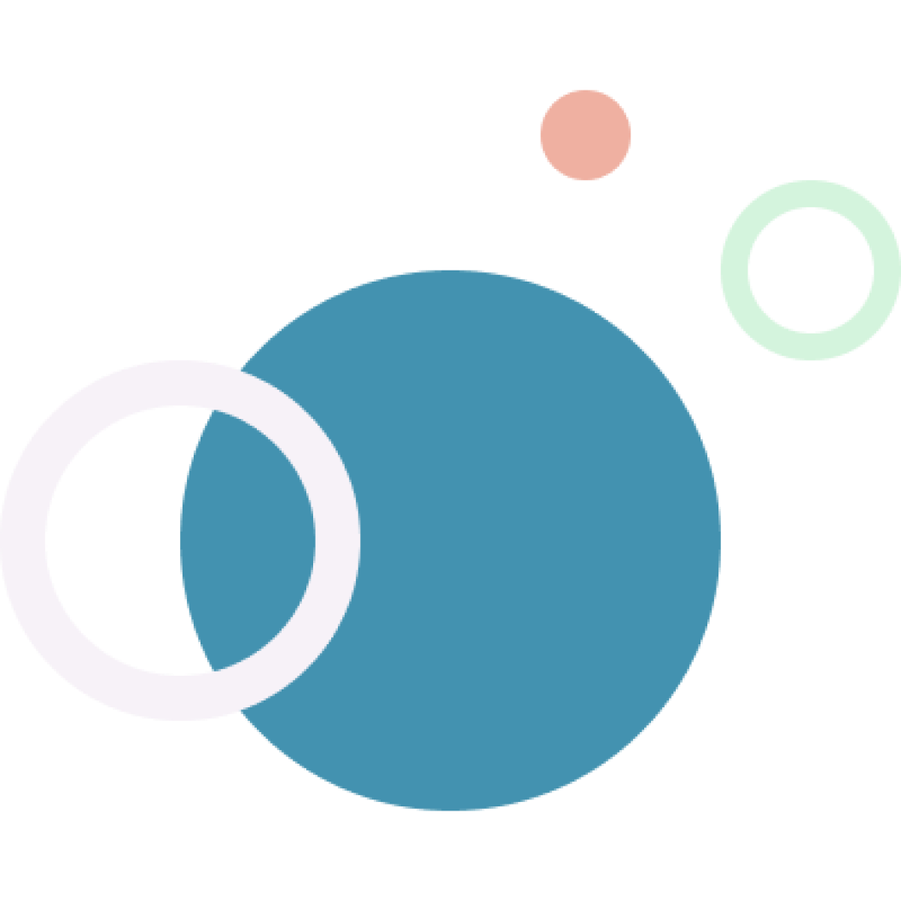

<!-- Repository Information & Links-->
<br />


<h5 align="center" style="padding:0;margin:0;">Priscilla Thabethe</h5>
<h5 align="center" style="padding:0;margin:0;">21100437</h5>
<h6 align="center">DV200 - Term 1 | 2022</h6>
</br>
<p align="center">

  <a href="https://github.com/cilla-thabethe/planet-rawg-final">
    
  </a>
  
  <h3 align="center">Planet Rawg</h3>

  <p align="center">
    A react project using the Space X Api to demonstrate data visualization using charts js  <br>
    
   <br />
   <br />
   <a href="https://www.loom.com/share/3c8e39a30bd849bbabed7e43df6c87e5">View Demo</a>
    ·
    <a href="https://github.com/cilla-thabethe/planet-rawg-final/issues">Report Bug</a>
    ·
    <a href="https://github.com/cilla-thabethe/planet-rawg-final/issues">Request Feature</a>
</p>

<!-- TABLE OF CONTENTS -->

## Table of Contents

* [About the Project](#about-the-project)
  * [Project Description](#project-description)
  * [Built With](#built-with)
* [Getting Started](#getting-started)
  * [Prerequisites](#prerequisites)
  * [How to install](#how-to-install)
* [Features and Functionality](#features-and-functionality)
* [Concept Process](#concept-process)
   * [Ideation](#ideation)
   * [Wireframes](#wireframes)
   * [Custom UI](#user-flow)
* [Development Process](#development-process)
   * [Implementation Process](#implementation-process)
        * [Highlights](#highlights)
        * [Challenges](#challenges)
   * [Future Implementation](#peer-reviews)
* [Final Outcome](#final-outcome)
    * [Mockups](#mockups)
    * [Video Demonstration](#video-demonstration)
* [Conclusion](#conclusion)
* [License](#license)
* [Contact](#contact)
* [Acknowledgements](#acknowledgements)

<!--PROJECT DESCRIPTION-->
## About the Project

<!-- header image of project -->


### Project Description

Planet Rawg is a data visualisation website. The data I used is from the RAWG API. It displays data about video games and even lets the user choose what information they want to see. 

### Built With

* [JavaScript](https://www.javascript.com/)
* [Node](https://nodejs.org/en/)
* [React](https://reactjs.org/)
* [React Chartjs 2](https://www.npmjs.com/package/react-chartjs-2)

## Getting Started

The following instructions will get you a copy of the project up and running on your local machine for development and testing purposes.

### Prerequisites

Ensure that you have the latest version of [NPM](https://www.npmjs.com/) installed on your machine. The [GitHub Desktop](https://desktop.github.com/) program will also be required.

### How to install

### Installation
Here are a couple of ways to clone this repo:

1. GitHub Desktop </br>
Enter `https://github.com/cilla-thabethe/planet-rawg-final.git` into the URL field and press the `Clone` button.

2. Clone Repository </br>
Run the following in the command-line to clone the project:
   ```sh
   git clone https://github.com/cilla-thabethe/planet-rawg-final.git
   ```
    Open `Software` and select `File | Open...` from the menu. Select cloned directory and press `Open` button

3. Install Dependencies </br>
Run the following in the command-line to install all the required dependencies:
   ```sh
   npm install
   ```

4. An API key is required

## Features and Functionality

### The Latest Game Data 

Planet Rawg visualises the latest gaming data you care about straight from the RAWG API.


### Dashboard

Users are introduced to the website and can view information about the platforms the games from the RAWG are available on. They can also see the total playtime of the games and a total of all game publishers. 


### Data Comparison

Users can select any two games from the dropdown menus, and they will automatically be compared to one another in the charts below the cards. 


### Timeline

Users are able to view the dates the video games were released on 

### Ideation

I started by looking for APIs with sufficient data for the project. After I settled on the RAWG API, I made mood boards to aid me in designing my website. I then sketched out my plans and came up with a colour pallet and designed a logo for my website.

### Mood Boards 
* [Mood Board](https://pin.it/7bIOlfr)
* [Mood Board](https://pin.it/2r1qMuZ)


### Wireframes


## Development Process

I created a website using Node.js and React. It is a single web page that uses routing to show and hide different pages. I got all my data asynchronously from a dataset and dynamically loaded it into my website. The data displayed with charts from Chart.js and within special cards I made for the games. 


### Implementation Process

* Utilized React `Charts.JS` dependency for Data visualization
* Implemented Routing with `React-Router v6`.
* API End Point: //api.rawg.io/api/games?key={API key}

#### Highlights

* The first time my doughnut chart populated with data from the API, When I saw it animating it made me so happy. 
* I always thought data was boring but I did a lot of research and learned that it can tell an interesting story I always thought data was boring but I did a lot of research and learned that it can tell an interesting story 
* Learning that a whole world of frameworks exists. I read about the ThreeJS library, and I would really like to give it a try during the holiday


#### Challenges

* While it was great to learn new things, I felt overwhelmed by having to do all of them at once
* My own self-doubt and anxieties, it made it rather difficult to focus on the project
* Balancing work life and my personal life


### Future Implementation

* I want to add a block on the Dashboard that displays the latest released video game 
* I would like to have games loaded in the Data Comparison page
* I would like to have a drop-down menu on the Timeline page, so the user gets to choose which timeline they want to see 
* I would also love to make the website responsive, so it works on mobile devices 


## Final Outcome

### Mockups


<br>


### Video Demonstration

To see a run through of the application, click below:

[View Demonstration](https://www.loom.com/share/3c8e39a30bd849bbabed7e43df6c87e5)

See the [open issues](https://github.com/cilla-thabethe/planet-rawg-final/issues) for a list of proposed features (and known issues).

## Authors

* **Cilla Thabethe** - [cilla-thabethe](https://github.com/cilla-thabethe/planet-rawg-final)


## License

Distributed under the MIT License. See `LICENSE` for more information.


## Contact

* **Cilla Thabethe** - [email@address](mailto:21100437@virtualwindow.co.za) - [@instagram_handle](https://www.instagram.com/instagram_handle/) 
* **Project Link** - https://github.com/cilla-thabethe/planet-rawg-final


## Acknowledgements

* [The Net Ninja](https://www.youtube.com/c/TheNetNinja)

